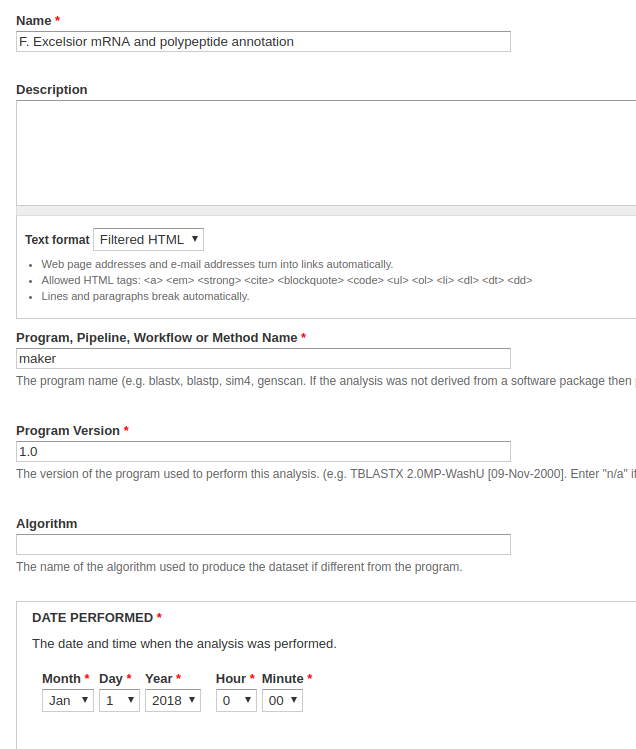
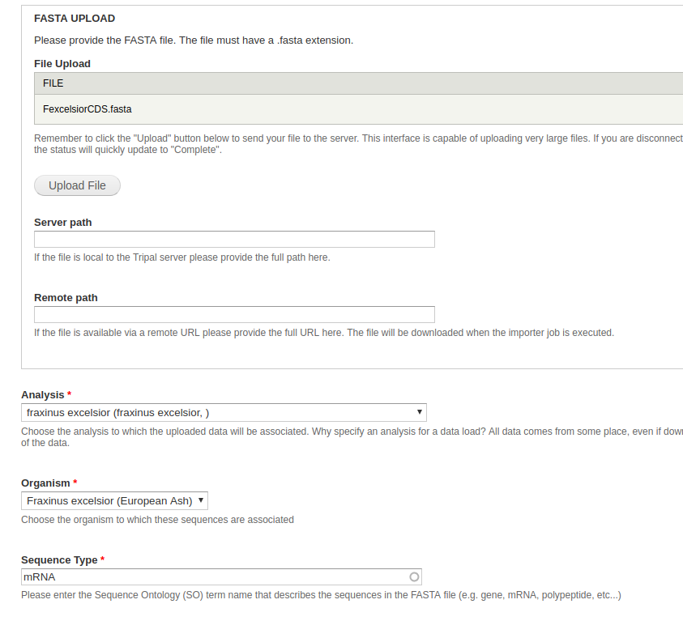

# Loading FASTA sequences

 FASTA is a universal sequence format: when we talk about loading mRNA and polypeptide sequences, we're referring to FASTA and the FASTA loader. This step will create a bunch of mRNA features with which we can associate other data (i.e. BLAST, Interpro, etc).

## Create an Analysis

We need an analysis with which to associate both our CDS (mRNA) and proteins (polypeptides).

Navigate to **Content > Tripal Content** and click **Add Tripal Content** at the top of the page. Select **Analysis**. Because this is mostly just data to populate a test site, what we insert into these fields doesn't really matter. Naturally, however, if this were for a site we were releasing for public use, we would want this information to be accurate.

* **Name** - Something along the lines of, **F. Excelsior mRNA and polypeptide annotation**.
* **Program, Pipeline, Workflow or Method Name** - Something along the lines of, **maker**.
* **Program Version** - Something along the lines of, **1.0**.
* **Date Performed** - You can keep this default, but it's common to set this to an arbitrary date (e.g. January 1st, 1900) if you're unsure of the time when the analysis was performed.
* **Data Source Name**
  - For a new transcriptome, this should be labeled, **de novo assembly**.

All other fields can be left blank or at their default values. Click save.

## Loading the mRNA FASTA file

We load in our mRNA data first, then our proteins. Using the admin menu, navigate to **Tripal > Data Loaders > Chado FASTA Loader**.

* **File Upload** - From the dataset, this is the `mrna_mini.fasta` file.
* **Analysis** - Select the newly created analysis.
* **Organism** - Select *Fraxinus excelsior*.
* **Sequence Type** - Enter *mRNA*

All other fields can be left blank or at their default values. Click **Import FASTA file**. A green header should appear at the top of the page with a job for you to run. Once your CDS have uploaded successfully, you can move on to uploading the polypeptides.

## Loading the Amino Acid (polypeptide) file

The process for uploading the polypeptides is similar to above, but with some slight differences to the fields.

* **File Upload** - From the dataset, this is the `FexcelsiorAA.minoas.fasta` file.
* **Analysis** - Select the newly created analysis.
* **Organism** - Select Fraxinus excelsior.
* **Sequence Type** - Enter *polypeptide*.

In the additional options section, you have the option to extract the feature name with a regexp, link your sequences to an external database using a regexp, and to define relationships.  Because our polypeptides are derived from our mRNA CDS, we'll set the **relationship type** to _produced by_, and provide a regexp to link the terms.  If you're following this guide with the _F. excelsior_ miniature dataset, then the proteins and mRNA have the same name, and you can use this regexp: `>(.*)`.

All other fields can be left blank or at their default values. Click **Import FASTA file**. A green header should appear at the top of the page with a job for you to run. Once your CDS have uploaded successfully.

## Viewing Results

For now, you won't be able to actually see your results through the user interface until we publish them. This is fine; assuming you have followed the guide, you shouldn't have any issues and can safely move on to the next steps.

However, if you really need to check, you can see your results through the database. Features can be found in the `chado.feature` table. If it's populated with the names of your features, you should be good to go.

It might also be worth checking the `chado.feature_relationship` table, as this is what determines whether the amino acids were successfully linked to the proteins. If it's populated, you should be good to go.
