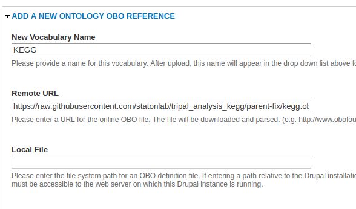
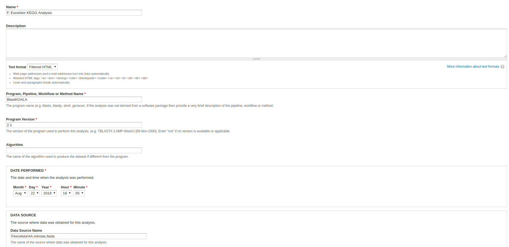
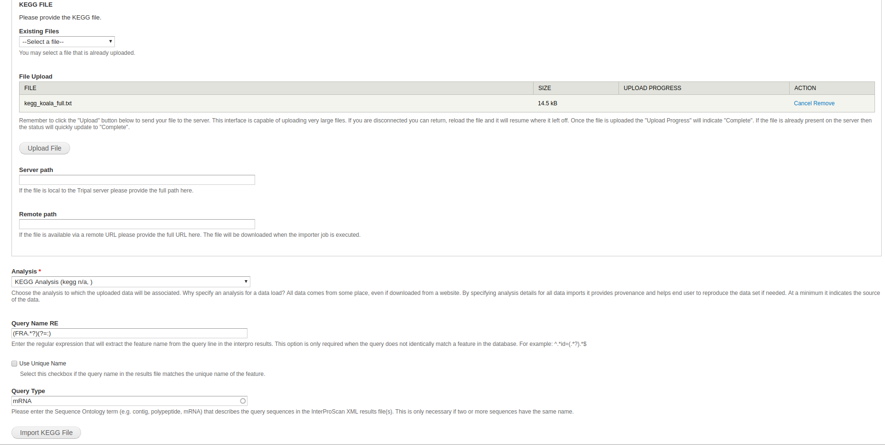

## Loading the KEGG Ontology

You will need to load the KEGG terms in before you can begin loading data. In the admin menu, navigate to **Tripal > Data Loaders > Chado Vocabularies > OBO Vocabulary Loader**. Click **Add a New Ontology OBO Reference**.

* **New Vocabulary Name** - You can just call this vocabulary KEGG.
* **Remote URL** - You can use the OBO from the [Staton Lab repo](https://github.com/statonlab/tripal_analysis_kegg/blob/parent-fix/kegg.obo) or the [Tripal repo](https://github.com/tripal/tripal_analysis_kegg/blob/7.x-3.x/kegg.obo) by copy and pasting the URL into this field.
* **Local File** - This field is an alternative to the Remote URL field. If you don't want to use a link, you can download the KEGG Ontology instead and simply specify the file path relative to your Drupal installation instead (e.g. sites/default/files/kegg.obo).

## Create an Analysis

We will need to create an analysis with which to associate our KEGG data. Navigate to Content > Tripal Content. At the top of the page, click Add Tripal Content and select Analysis from the list of content types. Some sites may have custom analysis types for each type of analysis performed.

* **Name** - Something along the lines of, **F. Excelsior KEGG annotation**.
* **Program, Pipeline, Workflow or Method Name** - Something along the lines of, **BlastKOALA**.
* **Program Version** - Something along the lines of, **2.1**.
* **Date Performed** - You can keep this default, but it's common to set this to an arbitrary date (e.g. January 1st, 1900) if you're unsure of the time when the analysis was performed.
* **Data Source Name** - This should be named after the protein file from which the KEGG data was obtained (e.g. FexcelsiorAA.minoas.fasta). 

All other fields can be left blank or at their default values. Click save.

## Loading KEGG Data

Now that we have the ontology and an analysis that we can associate our data with, we can begin loading the KEGG data. Navigate to **Tripal > Data Loaders > Chado KEGG Loader** in the admin menu. 

* **File Upload** - The KEGG file in the dataset is `f_excelsior_ko.txt`.
* **Analysis** - Select the KEGG analysis created for this data (i.e. the one created above).
* **Query Name RE** - A regular expression to match the names in the kegg output to features in the database.
* **Query Type** - The feature type you'd like to associate the annotations with.  Can be left blank if the name is unique and that is the desired feature type.

Users may choose to associate the KEGG annotations with the polypeptides themselves, **or** with the parent mRNA features in which case specifying a regular expression and/or type is necessary.

Once the fields are filled out, you can click `Import KEGG File`. Run the job provided and you should be good to go.
