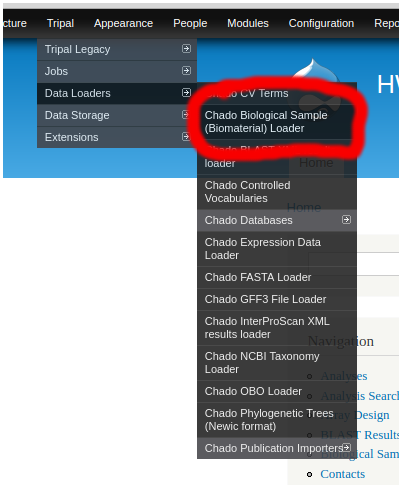
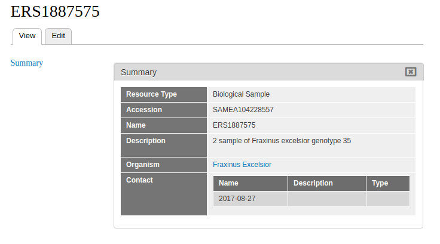

# Complete guide
## Load Biosamples

### Do **Not** create an analysis

The biosample importer allows you to specify an analysis: for this pipeline, don't.

### Load the samples

The Biosample loader is provided by the `tripal_biomaterial` module, and is located at `admin/tripal/loaders/chado_biosample_loader`.  Biosamples can be loaded as either an `xml` file, or a set of `csv/tsv` files.  `xml` is preffered, and can be optained from NCBI.  `csv/tsv` format requires that the first line is the column names for the biosample properties.  

Select the organism.  Note that loading biomaterials from multiple species at a time is not supported.  Split up your files to load one organism at a time.

After your file is uploaded, press the **Check Biomaterials** button to access the *CVTERM FIELD CONFIGURATION* section.  The section will list each property associated with your biosamples.  If a term exists in the CVterm database matching the property, it will appear in this section.  For **every biosample property**, associate the property with a CVterm.  In a perfect world, all terms will map to an established CV (sequence ontology, plant trait ontology, etc).  If no term is listed, or if the only terms listed are biomaterial_property terms, you should 

* Load appropriate CVterms for each property.  You can load an entire CV, or individual CVterms using the CVterm loader located at `admin/tripal/loaders/chado_cvterms`.
* Rename the properties in your source file so that they match existing CVterms.  You can look up available CVterms at `admin/tripal/loaders/chado_cvterms`.
* Re-upload the biosample file, and rerun **Check Biomaterials**.
* Repeat this process until you have suitable CVterms associated with all biosample properties.

That said, you can import your biosamples without assigning CVterms.  In this case, the generic biomaterial_property CV will be used.

After clicking Submit, you will need to run the job for the samples to be processed.

### Publish the biosamples

Once the samples are loaded, they must be published to appear as entities.  To do so, go to `Content -> Tripal Content -> Publish Tripal Content` and select the **Biological Sample** content type.

Once published, the biomaterial data can be located through the menu under **Content > Tripal Content.** Filter results by **Type > Biological Sample.**

Below is an example of successfully uploaded biomaterial data.

