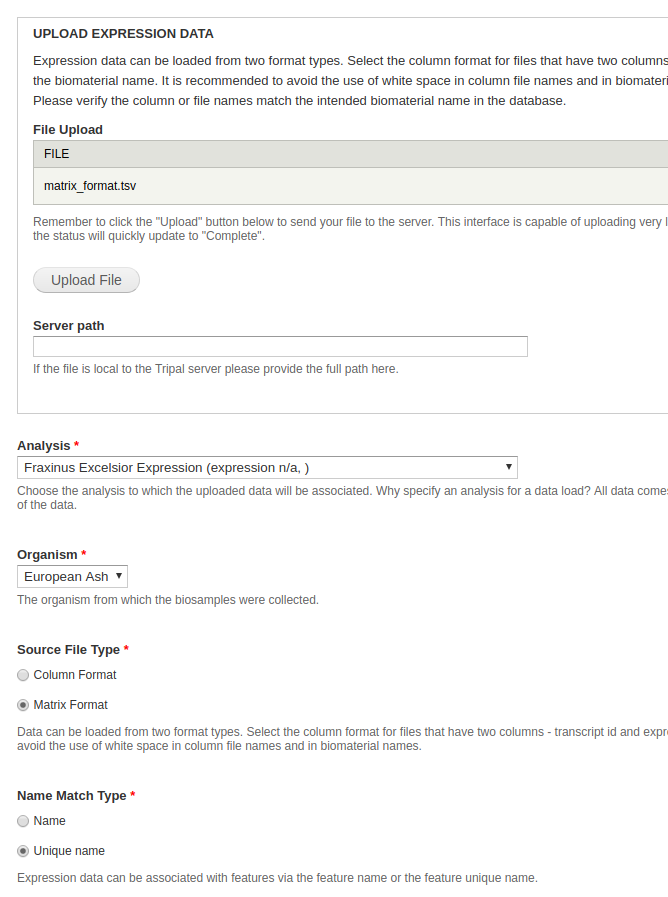

## Load Expression Data

### Create Analysis

You will first need an analysis to associate the expression data.  To do so, navigate to **Tripal_content -> Add Tripal Content**. Select **Analysis**.

* **Name** - Something along the lines of **Fraxinus Excelsior Expression**.
* **Program, Pipeline, Workflow or Method Name** - Something along the lines of **e.g DESESQ2**.
* **Program Version** - Something along the lines of **e.g 1.0*.
* **Date Performed** - Leave at default.

### Load the expression data

Expression data is loaded by the `tripal_analysis_expression` module using the Chado Expression loader, located at `admin/tripal/loaders/Chado_Expression_Data_Loader`. Expression data should be in column or matrix format.

* **File Upload** - For this dataset, the simplest method is uploading the **.tsv** file.
* **Analysis** - Select the same analysis specified for the biosamples.
* **Organism** - Select an organism.  In this case, the organism is **European Ash**.
* **Source File Type** - If you're uploading the .tsv file, select **Matrix**. If you're uploaded the .txt files, select **Column**. Keep in mind that if you upload the .tsv file, you do not need to upload the .txt files.
* **Name Match Type** - Select unique name.

All other fields can be ignored. Click **Import expression data**. A green header should appear at the top of the page with a job for you to run. Run it and you're done.

#### Publishing

Publishing is not necessary for expression data, as we don't create any new Tripal Entities.

### Viewing Expression Results

The easiest way to check to see if your expression results were successfully uploaded is by referring to the `chado_elementresult` table. If the table has contents, you know the results were uploaded successfully.

If you can't access the database, the alternative is to display the expression results directly on a feature page. Results are hidden by default, so we have to enable them in order to view them. This can be done with the admin menu by navigating to **Structure > Tripal Content Types**. In the row **mRNA**, click **Manage Fields** and towards the top of the window, click **Check for new fields**. This will take a moment, but a new field should be found called `data__gene_expression_data`.

At the top of the window, click **Manage Display**. Scroll all the way to the bottom of the window and look for a **Disabled** field, in which an **Expression** field should be contained. Move this out of the disabled table.

Now our results should be available to view. Navigate to any feature page (from the admin menu, Content > Tripal Content, click any record with type mRNA) and you should see your expression results.

